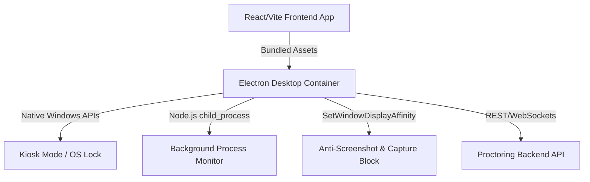

# Secure Assessment Desktop App (Lockdown Browser) Master Implementation Plan

This document outlines the master technical implementation plan to wrap the existing React/Vite assessment platform into a highly secure, OS-integrated desktop shell using **Electron** (or Tauri). 

---

## 🏗️ Architecture Overview



The desktop shell wraps the current web app and communicates directly with local system hardware and OS-level security layers to prevent common exam cheating mechanisms.

---

## 🔒 Key Security Features & Native APIs

### 1. Fullscreen Kiosk Mode (Strict Window Lock)
To prevent students from minimizing or leaving the application window:
* **Electron Window Configuration**:
  ```javascript
  const mainWindow = new BrowserWindow({
    fullscreen: true,
    kiosk: true, // Forces application to stay in foreground and intercepts OS commands
    alwaysOnTop: true,
    skipTaskbar: true,
    frame: false,
    webPreferences: {
      nodeIntegration: false,
      contextIsolation: true,
      preload: path.join(__dirname, 'preload.js')
    }
  });
  ```
* Intercept and disable shortcut combinations:
  * **Windows**: `Alt+Tab`, `Windows Key`, `Alt+F4`, `Ctrl+Esc`.
  * **macOS**: `Cmd+Tab`, `Cmd+Opt+Esc` (Force Quit), Swipe-to-Desktop gestures.

### 2. Native Anti-Screenshot & Screen Capture Blocking
To prevent candidates from taking screenshots or recording the assessment screen:
* **Windows API Integration**: Use Electron's native integrations to mark the window as secure, which turns any screenshot or video capture black:
  ```javascript
  // For Windows OS
  mainWindow.setContentProtection(true); // Electron wrapper for SetWindowDisplayAffinity
  ```
* **macOS Integration**: Set window protection properties using Mac-specific API properties inside `BrowserWindow`:
  ```javascript
  mainWindow.setVisibleOnAllWorkspaces(false);
  ```

### 3. Background Process Monitor (Blacklisted Software Detection)
Run background checks to detect, block, or force-close blacklisted apps (e.g., Discord, WhatsApp, Zoom, Teams, Snipping Tool, TeamViewer, AnyDesk):
* **Execution Strategy**:
  * Execute a periodic process query (every 2-3 seconds) using `child_process` execution:
    * **Windows**: `tasklist`
    * **macOS**: `ps -ax`
  * Parse active processes and match names against a blacklist.
  * If a violation is found, warn the student and prompt them to close the app, or programmatically force-terminate it (e.g. `process.kill(pid)`).

### 4. Direct Clipboard Disabling
* Hook into Electron's `clipboard` module to clear the system clipboard on launch and prevent any write/read actions:
  ```javascript
  const { clipboard } = require('electron');
  setInterval(() => {
    clipboard.clear(); // Continuous clipboard wipe to block copying/pasting out
  }, 1000);
  ```

---

## 🛠️ Step-by-Step Implementation Roadmap

### Phase 1: Environment Setup & Electron Integration (Days 1–3)
1. Initialize Electron packaging packages in the client root directory:
   ```bash
   npm install --save-dev electron electron-builder
   ```
2. Create `main.js` (main process controller) and `preload.js` (bridging script).
3. Update `vite.config.ts` to output assets suitable for native local file loading (`file://` protocol support, absolute vs relative paths).

### Phase 2: Native Security Features (Days 4–7)
1. Implement the **Kiosk Mode** setup inside the main process window initializer.
2. Implement `setContentProtection(true)` to hide the screen from OS capture tools.
3. Write the background process monitoring module to track and kill blacklisted tools.
4. Hook into Monaco editor event loops to disable context menus and DevTools keyboard combinations (`Ctrl+Shift+I` / `F12`).

### Phase 3: Packaging & Code Signing (Days 8–10)
1. Configure `electron-builder.json` with build specs for Windows and macOS.
2. Set up **Code Signing Certificates**:
   * Acquire a Windows Authenticode Certificate (for `.exe` installer signature).
   * Set up macOS Developer ID via Apple Developer account (for `.dmg` notarization).
   * This is required to prevent security alerts on installation.
3. Set up auto-update checks using `electron-updater`.

### Phase 4: Production QA & Deployment (Days 11–12)
1. Perform multi-monitor sanity checks (confirm second screens are blocked or turned off).
2. Verify virtual machine (VM) detection (prevent running the app inside VirtualBox or VMware).
3. Release signed installers for client testing.
